# ShopEase – Full Stack E-Commerce Platform

A complete, production-ready e-commerce web application built with **Spring Boot** and **React + Vite**, featuring JWT authentication, OTP email verification, cart management, order tracking, payment simulation, and a full admin dashboard with analytics charts.

---

## 🏗️ Architecture of the Project

### High-Level Architecture

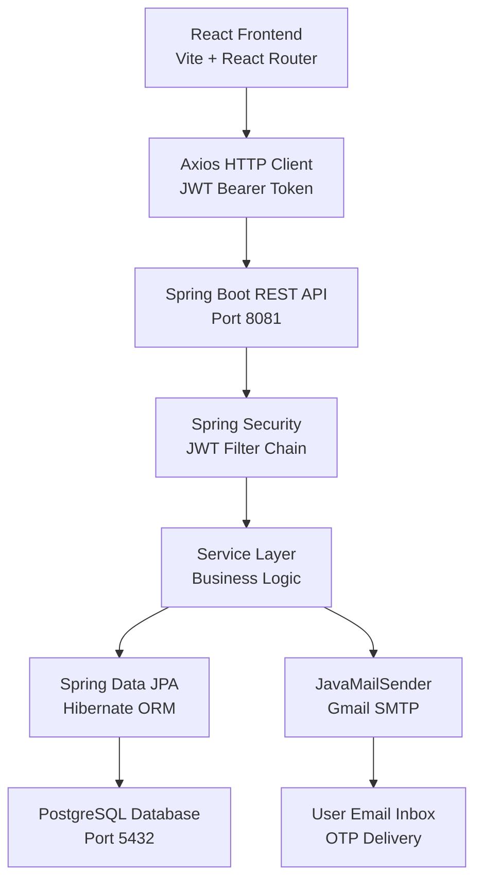

---

## 🔄 Flow of the Project

### Authentication Flow (OTP Verification)

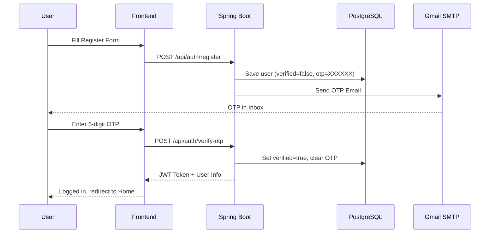

### Order Placement Flow

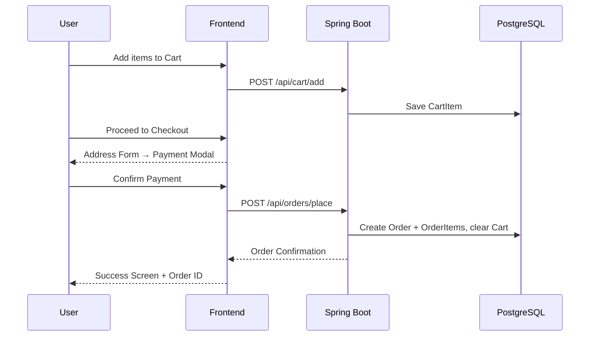

---

## 🛠️ Tech Stack

### Backend
| Technology | Version |
|---|---|
| Java | 17 |
| Spring Boot | 3.2.3 |
| Spring Security + JWT | 6.x / 0.11.5 |
| Spring Data JPA + Hibernate | 3.2.3 |
| Spring Mail (Gmail SMTP) | 3.2.3 |
| PostgreSQL | 17 |
| Lombok | Latest |
| Maven | 3.9.6 |

### Frontend
| Technology | Version |
|---|---|
| React | 19 |
| Vite | 5.4 |
| React Router DOM | 7 |
| Axios | 1.x |
| Recharts | 2.x |
| Node.js | 20.x |

---

## 📁 Project Structure

```
ecommerce-backend/
├── src/main/java/com/ecommerce/backend/
│   ├── config/          # Security, CORS, DataInitializer
│   ├── controller/      # Auth, Product, Cart, Order, Admin
│   ├── dto/             # Request/Response DTOs
│   ├── entity/          # User, Product, Cart, Order, OrderItem
│   ├── exception/       # GlobalExceptionHandler
│   ├── repository/      # JPA Repositories (with JOIN FETCH)
│   ├── security/        # JwtService, JwtAuthenticationFilter
│   └── service/         # AuthService, EmailService, CartService...
├── frontend/src/
│   ├── api/             # Axios instance
│   ├── components/      # Navbar (with cart badge)
│   ├── context/         # AuthContext, CartContext
│   └── pages/
│       ├── admin/       # Dashboard (charts), Products, Orders, Users
│       ├── Home, Products, ProductDetail
│       ├── Cart (3-step checkout)
│       ├── Orders (status tracker)
│       ├── Login, Register (OTP), ForgotPassword
├── Screenshot/          # App screenshots
├── docker-compose.yml
├── pom.xml
└── README.md
```

---

## ⚙️ Setup & Run

### 1. Database
```sql
CREATE DATABASE ecommerce_db;
```

### 2. Backend
```bash
# Set JAVA_HOME then run
.\mvnw.cmd spring-boot:run
# Runs on http://localhost:8081
```

### 3. Frontend
```bash
cd frontend
npm install
npm run dev
# Runs on http://localhost:3000
```

> Admin account is auto-created on first backend startup.

---

## � Screenshots

### 🏠 Home & Products
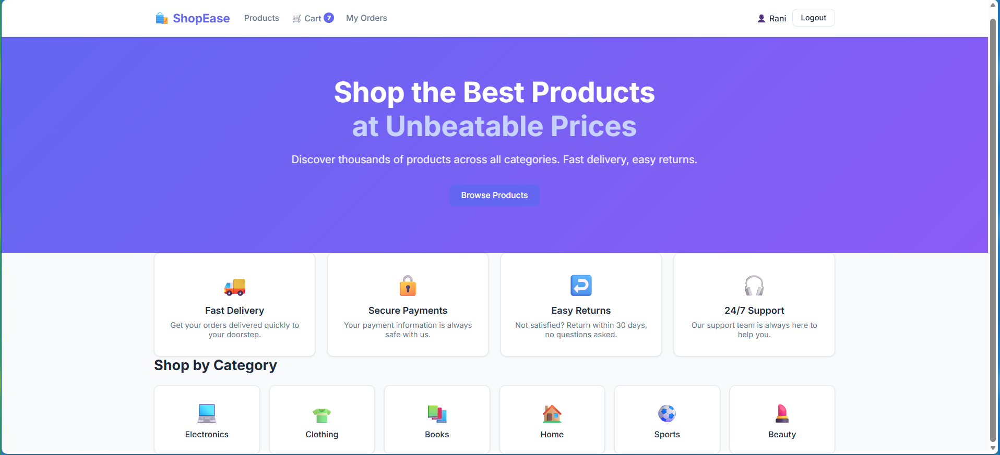
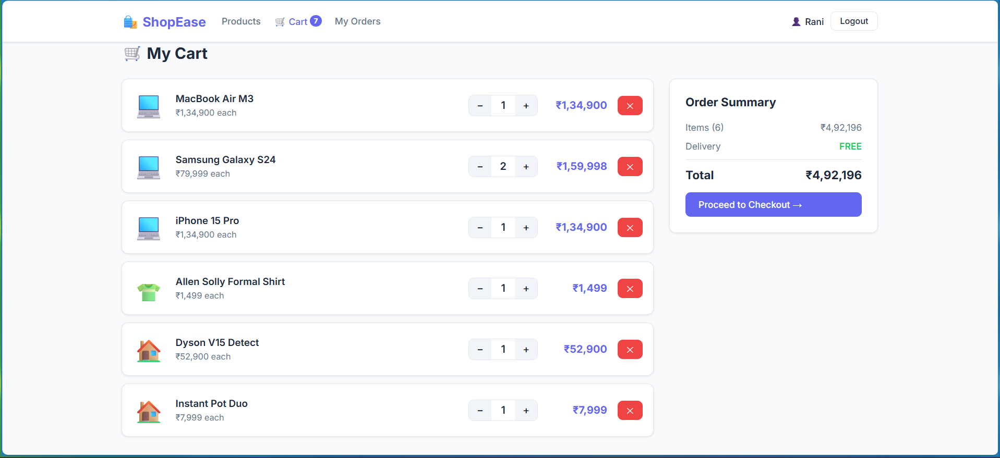
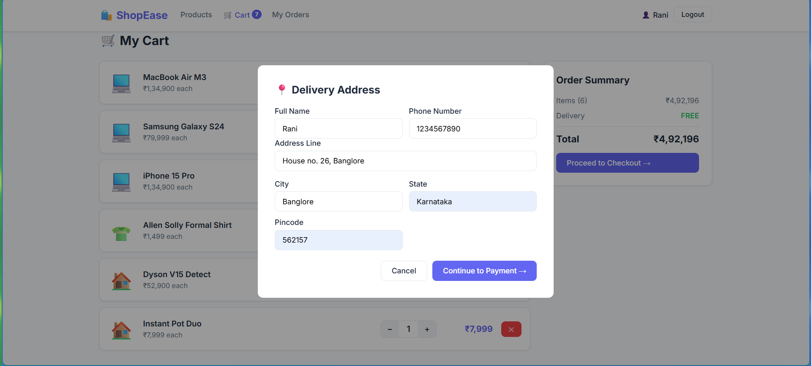

### 🔐 Authentication
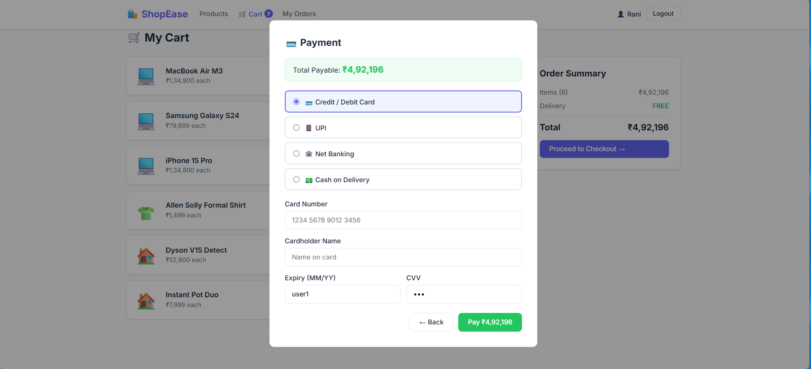
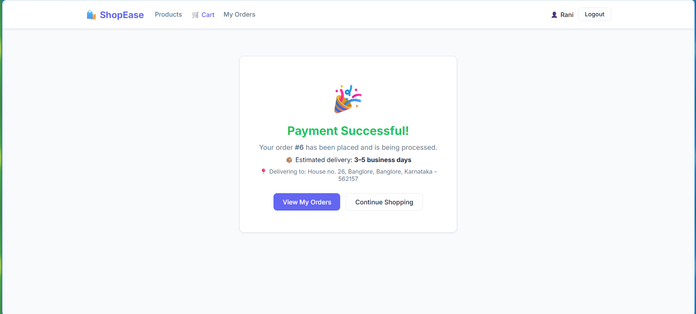
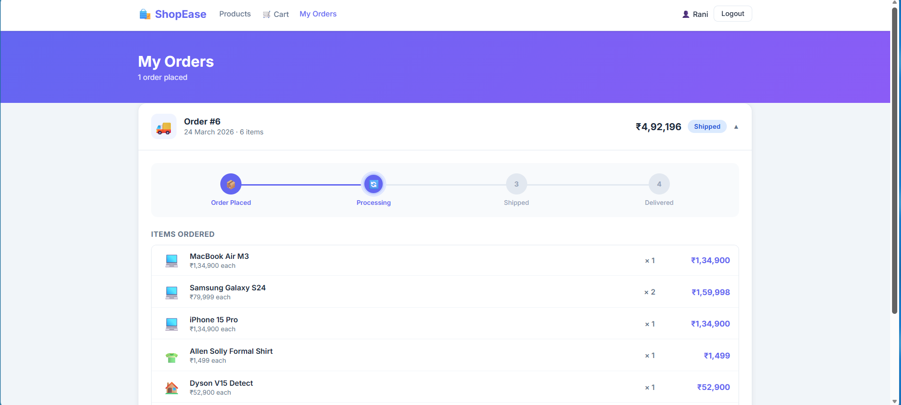

### 🛒 Cart & Checkout
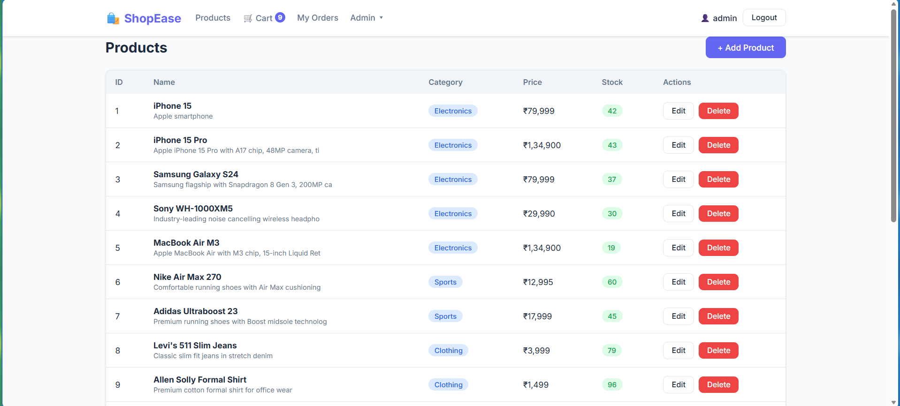
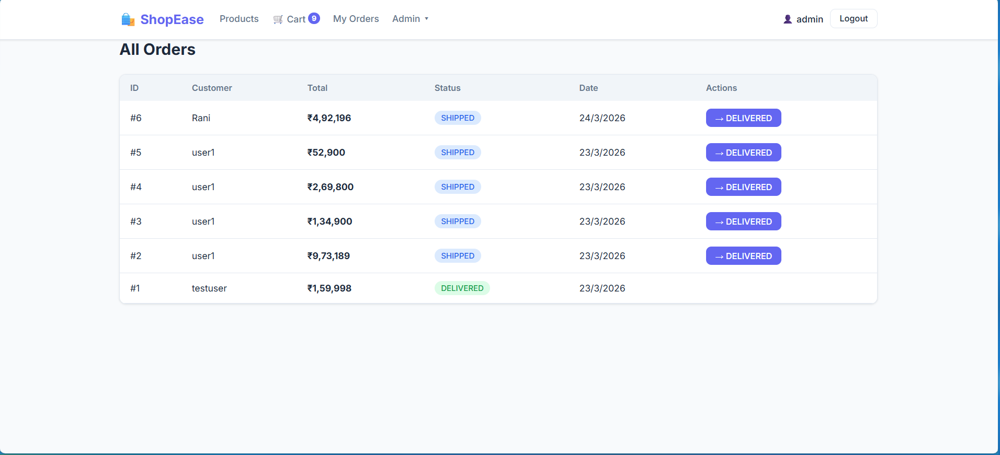

### 📦 Orders
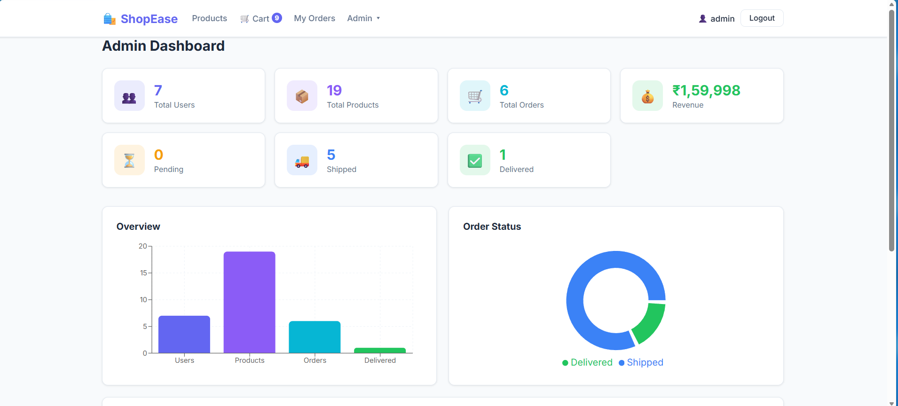
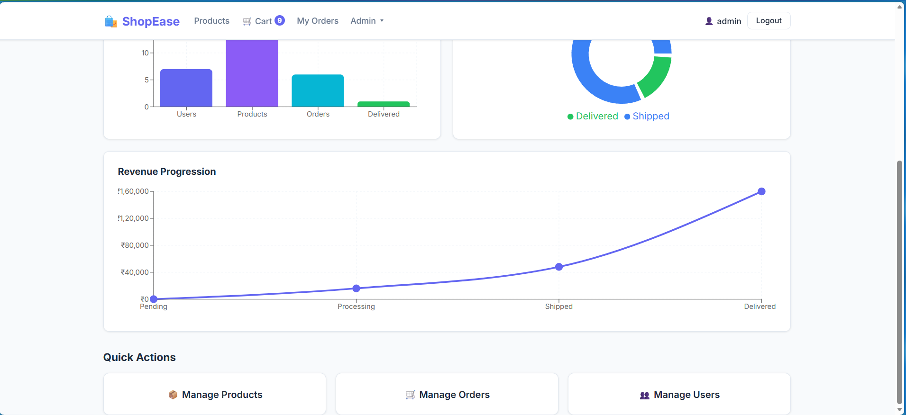

### 🛠️ Admin Dashboard
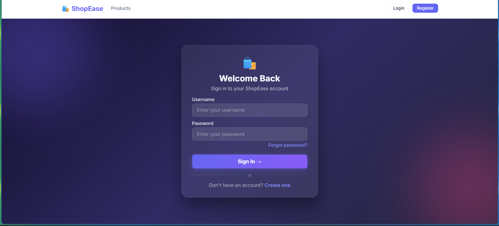
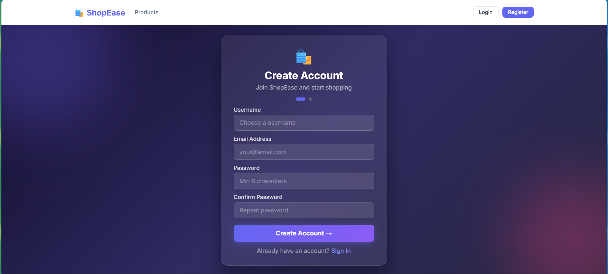

---

## 🔑 Key Features

- OTP email verification on registration (Gmail SMTP)
- Forgot password via OTP reset flow
- JWT-based stateless authentication
- Live cart count badge in navbar
- 3-step checkout: Address → Payment → Confirmation
- Payment simulation (Card / UPI / Net Banking / COD)
- 4-step order status tracker (Placed → Processing → Shipped → Delivered)
- Admin dashboard with Bar, Donut, and Line charts (Recharts)
- Custom delete confirmation modals (no browser `confirm()`)
- Glassmorphism auth pages with animated gradient background

---

*Developed with a focus on clean architecture, real-world auth flows, and polished UI/UX.*
